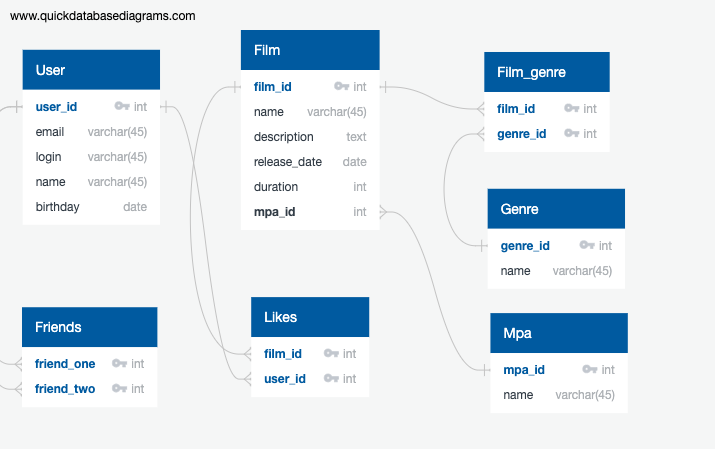

# Filmorate project

### Первичные ключи /внешние ключи в таблицах /уточнения

#### User

- user_id - PK

#### Friends

- friend_one - PK, FK >- User.user_id
- friend_two - PK, FK >- User.user_id

#### Film

- film_id - PK,
- mpa_id int FK >- Mpa.mpa_id

#### Likes

- film_id - PK, FK >- Film.film_id
- user_id - PK, FK >- User.user_id

#### Genre

- genre_id - PK

#### Film_genre

- film_id - PK, FK  >- Film.film_id
- genre_id - PK, FK  >- Genre.genre_id

#### Mpa

- mpa_id PK

### Примеры запросов

#### Получение всех пользователей с количеством друзей

`
SELECT
u.user_id
u.user_name,
COUNT(f.friend_two) AS friends
FROM User
LEFT JOIN Friends AS f ON f.friend_one = u.user_id
GROUP BY f.friend_two
`

#### Получение всех фильмов с количеством лайков

`
SELECT
f.film_id
f.film_name,
COUNT(l.user_id) AS likes
FROM Film
LEFT JOIN Likes AS l ON f.film_id = l.film_id
GROUP BY l.user_id
`

#### Получение всех фильмов с их жанрами

`
SELECT
f.film_id
f.film_name,
g.name
FROM Film
LEFT JOIN Film_genre AS fg ON f.film_id = fg.film_id
LEFT JOIN Genre AS g ON fg.genre_id = g.genre_id
`
