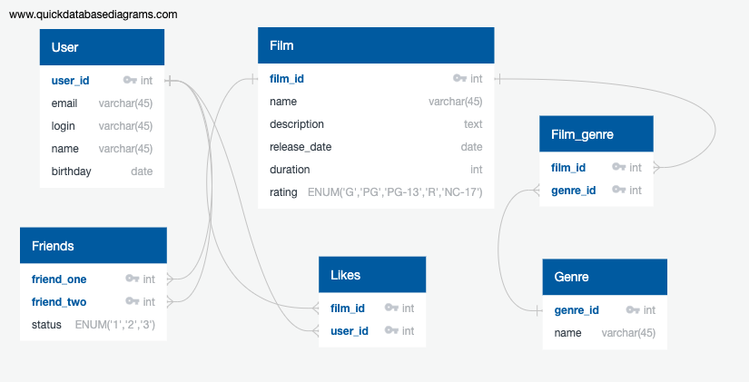

# Filmorate project

### Первичные ключи /внешние ключи в таблицах /уточнения

#### User

- user_id - PK

#### Friends

- friend_one - PK, FK_user_id
- friend_two - PK, FK_user_id
- status - ENUM('0','1','2'), 0 - в ожидании, 1 - запрос дружбы, 2 - подтверждение дружбы

#### Film

- film_id - PK

#### Likes

- film_id - PK, FK_film_id
- user_id - PK, FK_user_id

#### Genre

- genre_id - PK

#### Film_genre

- film_id - PK, FK_film_film_id
- genre_id - PK, FK_genre_genre_id

### Отношения между таблицами / полями

Таблица User относится к таблице Friends как один ко многим.
Таблица Film относится к таблице Likes как один ко многим.
Таблица Film относится к таблице Film_genre как один ко многим.
Таблица Genre относится к таблице Film_genre как один ко многим.

### Примеры запросов

#### Получение всех пользователей с количеством друзей

`
SELECT
u.user_id
u.user_name,
COUNT(f.friend_two) AS friends
FROM User
LEFT JOIN Friends AS f ON f.friend_one = u.user_id
WHERE f.status = '2' -- Дружба подтверждена
GROUP BY f.friend_two
`

#### Получение всех фильмов с количеством лайков

`
SELECT
f.film_id
f.film_name,
COUNT(l.user_id) AS likes
FROM Film
LEFT JOIN Likes AS l ON f.film_id = l.film_id
GROUP BY l.user_id
`

#### Получение всех фильмов с их жанрами

`
SELECT
f.film_id
f.film_name,
g.name
FROM Film
LEFT JOIN Film_genre AS fg ON f.film_id = fg.film_id
LEFT JOIN Genre AS g ON fg.genre_id = g.genre_id
`
